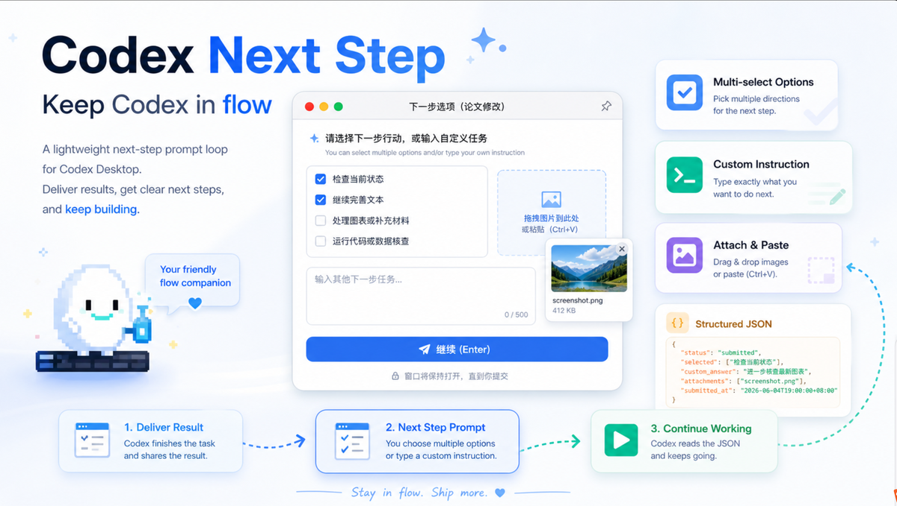
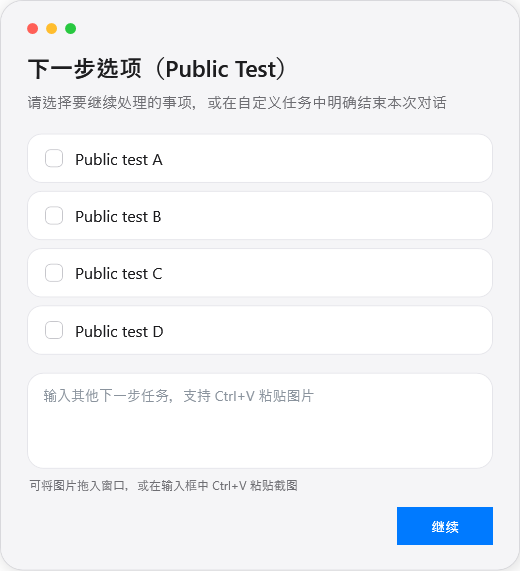

# Codex Next Step

把 Codex Desktop 的每轮交付，变成一个持续、顺滑、可选择的下一步工作流。

Codex Next Step is a lightweight Windows WPF prompt loop for Codex Desktop. It lets an agent deliver a result, open a native-looking next-step window, wait until the user replies, return structured JSON, and keep working without breaking flow.



真实窗口效果：



## 为什么需要它

普通文本追问很容易打断节奏。用户需要手动组织下一步，助手也容易在“任务完成”后直接结束。Codex Next Step 把这一段变成一个稳定的交互界面：助手先交付结果，然后弹出下一步窗口。用户可以勾选多个方向，也可以直接输入自定义指令。提交后，助手读取 JSON 并继续执行。

它适合长时间写作、代码修改、数据核查、论文处理、图表迭代和任何需要持续协作的任务。

典型场景包括：

- 写完一段稿件后，选择继续润色、查引用、改图表或生成 Word
- 改完代码后，选择继续补测试、跑数据核查或检查文件状态
- 处理图片或材料时，直接粘贴截图作为下一轮输入
- 多个 Codex 对话同时工作时，用窗口标题区分不同对话

## 核心功能

- 4 个动态复选项，由当前任务通过 `-OptionsJson` 生成
- 自定义输入框，支持直接写下一步任务
- 支持拖拽图片和 `Ctrl+V` 粘贴截图
- 返回结构化 JSON，便于 agent 继续执行
- 窗口会一直等待用户提交，适合心流模式
- 进入和退出都有轻量动画
- 默认只保留最近一次完整回复，减少历史堆积
- 不依赖 MCP elicitation，也不使用 Tk 默认界面

## 快速安装

```powershell
git clone https://github.com/yufanwu345-eng/codex-next-step.git
cd codex-next-step
.\install.ps1
```

默认安装到：

```text
%USERPROFILE%\.codex\next-step
```

安装后，把 `AGENTS_TEMPLATE.md` 中的规则复制到项目 `AGENTS.md` 或全局 Codex instructions 的靠前位置。

## 在 Codex 中接入

建议在规则文件中写入类似指令：

```text
每轮非结束性回复都要先交付结果，再调用
%USERPROFILE%\.codex\next-step\ask_next_step.ps1。
调用时必须传稳定的 -DialogName 和本轮动态 -OptionsJson。
外层工具 timeout_ms 必须至少为 86400000。
除非用户在自定义输入中明确要求结束或暂停，否则读取返回 JSON 后继续执行。
```

这个窗口是阻塞式的。也就是说，它会保留到用户提交为止。这正是它能够维持连续工作流的原因。

## 手动调用示例

```powershell
$options = '["检查当前状态","继续完善文本","处理图表或补充材料","运行代码或数据核查"]'
& "$env:USERPROFILE\.codex\next-step\ask_next_step.ps1" `
  -OptionsJson $options `
  -Message "请选择下一步，也可以输入自定义任务" `
  -DialogName "论文修改"
```

`-OptionsJson` 可以是字符串数组，也可以是带 `label` 字段的对象数组：

```powershell
$options = @(
  @{ label = "检查当前状态"; description = "可选说明，agent 可自行使用" },
  @{ label = "运行数据核查"; description = "可选说明，agent 可自行使用" }
) | ConvertTo-Json -Depth 5 -Compress
```

从 Codex 工具调用时，外层命令需要设置长等待：

```json
{
  "command": "& \"$env:USERPROFILE\\.codex\\next-step\\ask_next_step.ps1\" -OptionsJson $options -DialogName \"论文修改\"",
  "timeout_ms": 86400000
}
```

## 返回 JSON

```json
{
  "status": "submitted",
  "selected": ["检查当前状态"],
  "custom_answer": "顺便检查最新图表。",
  "attachments": [],
  "dialog_name": "论文修改",
  "choice_path": "C:\\Users\\you\\.codex\\next-step\\last_choice.json",
  "submitted_at": "2026-06-04T19:00:00+08:00"
}
```

读取最近一次结果：

```powershell
& "$env:USERPROFILE\.codex\next-step\read_next_step.ps1"
```

## 字体说明

公开仓库默认不捆绑任何第三方字体，避免再分发授权风险。界面默认使用系统字体。

如果你拥有某个字体的合法使用和分发权限，可以通过环境变量指定本地字体：

```powershell
$env:CODEX_NEXT_STEP_FONT_PATH = "C:\Path\To\YourFont.ttf"
$env:CODEX_NEXT_STEP_FONT_FAMILY = "Your Font Family Name"
```

## 隐私策略

默认只保留 `last_choice.json` 中的最近一次完整回复。每轮临时 `choices\*.json` 会在父进程读取后删除。日志只记录选择数量、文本长度、附件数量等元信息，不记录完整自定义文本。

如果你需要调试完整历史，可以显式传入：

```powershell
-KeepChoiceHistory
```

运行时文件已经写入 `.gitignore`，避免误提交日志、截图、附件或最新回复。

## 测试

```powershell
$options = '["测试选项 A","测试选项 B","测试选项 C","测试选项 D"]'
& .\ask_next_step.ps1 -Mode test-submit -OptionsJson $options -DialogName "测试"
& .\ask_next_step.ps1 -Mode test-empty -OptionsJson $options -DialogName "测试"
```

## English

Codex Next Step turns every Codex Desktop handoff into a smooth, persistent next-step workflow.

Instead of ending with a plain text follow-up, the agent delivers its result and opens a native-looking WPF prompt. The user can select multiple next actions, type a custom instruction, paste or drop images, and submit. The tool returns structured JSON so the agent can continue immediately.

Typical use cases:

- Continue editing, checking citations, handling figures, or exporting documents after a writing task
- Run tests, inspect state, or continue implementation after a coding task
- Paste screenshots as attachments for visual feedback
- Keep several Codex threads moving while using dialog titles to tell prompts apart

### Highlights

- Dynamic checkbox options from `-OptionsJson`
- Custom instruction input
- Drag-and-drop and `Ctrl+V` image attachments
- Structured JSON output
- Blocking wait until the user submits
- Smooth fade-in and fade-out animations
- Latest-response-only storage by default
- No Tk UI and no dependency on MCP elicitation

### Install

```powershell
git clone https://github.com/yufanwu345-eng/codex-next-step.git
cd codex-next-step
.\install.ps1
```

Default install path:

```text
%USERPROFILE%\.codex\next-step
```

Copy `AGENTS_TEMPLATE.md` into your project-level or global Codex instructions.

### Agent Rule

```text
After every non-final response, deliver the result, then call
%USERPROFILE%\.codex\next-step\ask_next_step.ps1 with a stable -DialogName
and dynamic -OptionsJson. The outer timeout_ms must be at least 86400000.
Continue from selected/custom_answer unless the custom answer explicitly
asks to end or pause.
```

### License

MIT
